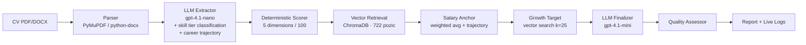
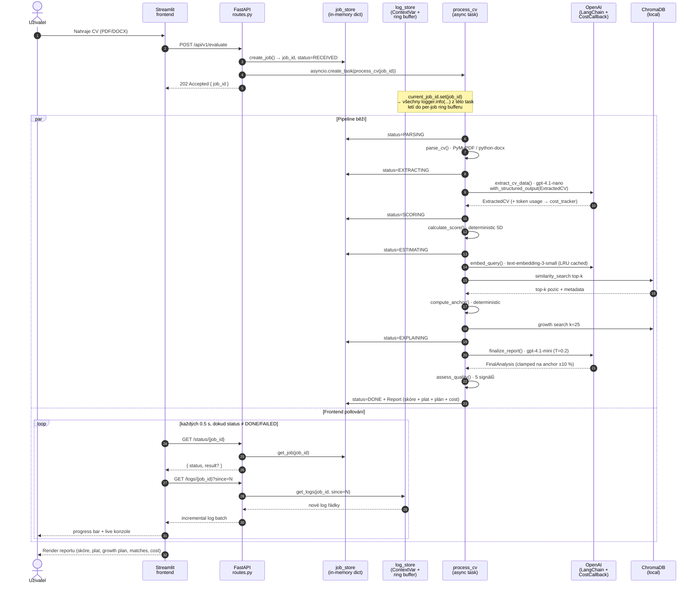

# 🧠 AI Job Fit & Salary Estimator

Case-study demo: nahraj CV (PDF/DOCX) a získej extrahovaný profil, 5-rozměrné skóre seniority, deterministicky vypočítaný odhad měsíční mzdy v ČR a konkrétní cestu k +30 % platu.

Postavené nad daty z [platy.cz](https://platy.cz) (722 pozic).

---

## Quick start

### Docker (doporučené)

```powershell
# 1. zkopíruj .env.example a doplň OPENAI_API_KEY
copy .env.example .env
# (otevři .env a vlož klíč)

# 2. spusť celý stack
docker compose up -d --build

# 3. ověř, že oba containery jsou healthy
docker compose ps

# 4. otevři http://localhost:8550
#    (host port 8550 → container port 8501; viz docker-compose.yml,
```

Stop / restart / logs:

```powershell
docker compose logs -f backend     # follow backend logs
docker compose restart backend     # po změně .env
docker compose down                # zastav vše
docker compose down -v             # včetně volumes (pozor: smaže Chroma store)
```

**Embeddings nemusíš připravovat** – `backend/data/positions_embeddings.jsonl` (722 vektorů) je committed v repu. Při prvním startu se Chroma DB z něho automaticky naplní (~5 s, žádné OpenAI volání pro pozice). Bind mount `./backend/data` drží Chroma store přes všechny rebuildy. Regenerace JSONL je `make build-embeddings` v `backend/` (jen když měníš zdrojová data).

### Lokální dev (rychlejší iterace, bez dockeru)

```powershell
# Backend
cd backend; uv sync; uv run uvicorn cv_evaluator.main:app --reload --port 8000

# Frontend (v dalším terminálu)
cd frontend; uv sync; $env:API_URL="http://localhost:8000"; uv run streamlit run app.py
```

`.env` má backend pro lokální dev v repo rootu (config.py ho hledá automaticky).

### API dokumentace

FastAPI auto-generuje OpenAPI specifikaci a interaktivní Swagger UI – po startu backendu jsou dostupné na:

- **Swagger UI** → <http://localhost:8000/docs> (vyzkoušíš endpointy přímo v prohlížeči)
- **ReDoc** → <http://localhost:8000/redoc> (čitelnější reference)
- **OpenAPI JSON** → <http://localhost:8000/openapi.json> (pro klientí codegen)

Endpointy: `POST /api/v1/evaluate` (upload), `GET /api/v1/status/{job_id}`, `GET /api/v1/logs/{job_id}?since=N`, `GET /health`.

---

## Jak jsem přistoupil k datům

Zadání mi explicitně neposkytuje žádný dataset, takže jsem si ho musel obstarat. Volby:

**A) Použít LLM jako oracle pro mzdy** ❌ Halucinace, neexistuje ground truth, výsledky se mění mezi runy.

**B) Synthetic data od LLM** ❌ Reflektuje LLM predispozici, ne český trh.

**C) Reálný platový dataset** ✅ Použil jsem [platy.cz](https://platy.cz) – veřejně dostupné platové percentily pro 722 pozic v ČR.

### Co je v `backend/data/salaries.jsonl`

Každý záznam obsahuje:

```json
{
  "group": "Informační technologie",
  "position": "Programátor (vývojář)",
  "p10_monthly_czk": 38000,        // 10. percentil
  "p90_monthly_czk": 90000,        // 90. percentil
  "after_5_years_monthly_czk": 65000,
  "category_low_monthly_czk": null, // fallback pokud konkrétní pozice nemá data
  "category_high_monthly_czk": null,
  "duties": ["...", "..."]         // popis povinností (vstup do retrievalu)
}
```

### Co jsem s daty udělal

1. **Normalizace na canonical schéma**: `salary_low / salary_high / salary_after_5y` + `salary_source ∈ {position, category}`. Pokud konkrétní pozice nemá percentily (`has_position_data: false`), použije se rozpětí celé profesní skupiny a označí jako méně přesný zdroj (`category`). Frontend tuto fallback-úroveň zobrazuje uživateli (badge "konkrétní pozice" vs. "celá skupina").

2. **Pre-computed embeddings** (`scripts/build_embeddings.py`): jednorázově se zavolá `text-embedding-3-small` nad textem `"{position} ({group}). {duties}"` a vektory se uloží do `positions_embeddings.jsonl`. Při startu serveru se hydratuje ChromaDB z tohoto souboru – **runtime nikdy nevolá OpenAI pro embedding pozic**, jen pro embedding query CV.

3. **Nemám hardcoded skill taxonomii**: zkusil jsem si ji vyrobit (~250 skillů s tier weighting), ale narazil na škálovatelnost (pizzaři, sommeliéři, kominíci...). Místo toho LLM klasifikuje skill tier (`expert/core/basic`) přímo v rámci extrakce – funguje univerzálně napříč obory bez údržby.

4. **Eval golden dataset** (17 ručně anotovaných CVs): vlastní syntetické CVs pokrývající IT i non-IT obory s ground-truth seniority/salary range. Slouží pro měření kvality pipeline (`make eval`).

### Limitace dat

- ČR-specifické (platy.cz nemá data o EU/UK/US trzích)
- Snapshotted v čase (jaro 2026), nepřepočítává se k inflaci
- Některé pozice mají jen "category" fallback → méně přesné odhady (UI to označuje)
- Žádné regional data (Praha vs. regiony) – v této verzi ignorováno

---

## Architektura



### Životní cyklus jobu (async pipeline + log streaming)

Druhý pohled – časová osa jednoho requestu:



**Co tenhle diagram vlastně ukazuje:**

1. **Upload není blocking** – API vrátí `202` okamžitě po naplánování tasku. Žádný request timeout, žádné HTTP keep-alive nad LLM voláními.
2. **`ContextVar` je klíč k log isolation** – v kroku označeném `current_job_id.set(...)` se propíše do asyncio task scope, takže každé `logger.info(...)` v `salary_anchor.py`, `embeddings.py` apod. ví, do kterého ring bufferu má jít. Souběžné joby se nikdy nemíchají, ale ani jeden pipeline modul nemusí přijímat `job_id` parametrem.
3. **Polling, ne SSE** – jednoduché, robustní, debugovatelné. SSE / WebSocket by snížilo perceived latency, ale přidalo komplexitu pro tento scope nehodnou.
4. **Cost tracker je transparentní LangChain callback** – `CostCallback.on_llm_end` se napojí na každé volání a feeduje `cost_tracker`. Žádné manuální `tokens_used = ...` boilerplate v pipeline.

### Klíčové stavební bloky

| Komponenta | Soubor | Co dělá |
|---|---|---|
| **Parser** | `backend/src/cv_evaluator/steps/parser.py` | PDF/DOCX → text |
| **Extractor** | `steps/extractor.py` + `prompts/extractor.py` | LLM call s `with_structured_output(ExtractedCV)`. Extrahuje skills (s **canonical názvem + tier classification expert/core/basic** pro každý), praxi, education, role, **personality traits** (4 kategorie) a **career trajectory**. Funguje univerzálně napříč obory (IT, zdravotnictví, řemesla, …) – žádná hardcoded taxonomie. |
| **Scorer** | `steps/scorer.py` | Rule-based 5D skóre 0-100. Maxima: experience=35, skills=25 (tier-weighted z LLM klasifikace), education=10, role=15, **personality=15**. České + EN role keywords s diakritickou normalizací. |
| **Retrieval** | `services/embeddings.py` | Cosine similarity vůči 722 pozicím v ChromaDB. Query je **position-driven**, ne skill-driven. |
| **Salary Anchor** | `steps/salary_anchor.py` | **Deterministická** kotva: vážený průměr matchů × seniority skóre × trajectory modifier. LLM má povolen drift jen ±10 %. |
| **Growth Target** | `steps/growth_target.py` | Najde konkrétní roli, která dosahuje `anchor.center × 1.30`. Vector search nad ChromaDB (k=25), filtr na cílovou mzdu, pick by similarity. |
| **Finalizer** | `steps/finalizer.py` + `prompts/finalizer.py` | Druhý LLM call: dostane všechno výše + anchor jako constraint, vyrobí salary range, vysvětlení a actionable growth plan. |
| **Quality Assessor** | `steps/quality_assessor.py` | 5 sanity signálů → `high/medium/low` confidence. |
| **Cost Tracker** | `services/cost_tracker.py` | Per-job USD/CZK náklady přes LangChain callbacks. |

---

## Jak to funguje krok za krokem

Tato sekce rozebírá každý pipeline krok do hloubky: **co dělá**, **proč právě takto** a **co jsem zvažoval, ale nevybral**. Cross-cutting rozhodnutí (proč 2 LLM volání, proč deterministická kotva, proč LLM-based tier classification) jsou v sekci [Design decisions](#design-decisions) níž.

### 1. Parser – [parser.py](backend/src/cv_evaluator/steps/parser.py)

**Mechanika.** Detekce formátu podle koncovky → `fitz` (PyMuPDF) pro PDF, `python-docx` pro DOCX. Stránky/odstavce se joinují `\n`. Vrací `CVData(raw_text, filename)`.

**Klíčové detaily.**

- Při textu < 100 znaků padá `logger.warning(...)` – signál pro user-side, že CV je nejspíš sken bez OCR vrstvy.
- Žádný regex preprocessing, žádné "section detection" (zkušenosti / vzdělání / …). Extractor LLM tohle zvládá lépe a robustněji než heuristika.
- Velikost vstupu omezena na 10 MB v API vrstvě ([routes.py](backend/src/cv_evaluator/api/routes.py) + Streamlit `maxUploadSize=10` v `.streamlit/config.toml`). Důvod: typické CV má < 1 MB; 10 MB je obří rezerva, ale chrání před DoS přes obří soubor.

**Proč PyMuPDF a ne pdfplumber / pdfminer.six.** PyMuPDF je rychlejší (C++ binding) a robustnější na komplikované layouty (vícesloupcové CVs). Pdfplumber je lepší na tabulky, ale CVs jsou primárně lineární text. Pdfminer.six je pomalý.

**Co jsem zvažoval a nezvládl.** **OCR fallback** (pdf2image + Tesseract / EasyOCR) pro scanované PDF. Reálně by to znamenalo +200 MB závislosti, řádově pomalejší pipeline a nejasný ROI v ČR (většina CVs je z LinkedInu nebo Wordu, ne sken). Místo toho aspoň warning v UI, ať uživatel ví, že má re-uploadnout textový soubor.

---

### 2. Extractor (LLM call #1) – [extractor.py](backend/src/cv_evaluator/steps/extractor.py) + [prompts/extractor.py](backend/src/cv_evaluator/prompts/extractor.py)

**Mechanika.** `ChatOpenAI(gpt-4.1-nano, T=0).with_structured_output(ExtractedCV)` → JSON garantovaný OpenAI Structured Outputs (strict `json_schema`). Vstup: `raw_text`. Výstup: `ExtractedCV` (skills s tier classification, role, yoe, education, personality traits, career trajectory, industries, languages).

**Klíčové detaily.**

- **Tier classification je inline v extrakci, ne v samostatném kroku.** LLM klasifikuje každý skill do `expert/core/basic/unknown` ve stejném volání jako extrakci. Detail proč: viz [Design decisions #4](#4-proč-llm-based-tier-classification-ne-hardcoded-taxonomie).
- **Canonical naming je instrukce v promptu**, ne post-processing: `"Python"` ne `"python"`, `"AutoCAD"` ne `"autocad 2024"`. Sjednocení velkých písmen, odstranění verzových sufixů. Důsledek: skills jsou rovnou porovnatelné napříč CVs bez normalizační heuristiky.
- **`Field(description=...)` v `models.py` plní dvě role** – validuje výstup pro pydantic a slouží jako instrukce pro LLM přes JSON schema (Structured Outputs schéma obsahuje `description`). Změna popisu = změna prompt-engineering.
- **Retry strategy je explicitní a úzký**: `tenacity` retryuje jen `APITimeoutError / RateLimitError / APIConnectionError / InternalServerError`. `BadRequestError`, `AuthenticationError` apod. padají hned – jsou to logické chyby, kterým retry nepomůže. Exponential backoff (2 s → 10 s), max 3 pokusy.
- **Personality traits = parafráze z CV, ne hodnocení.** Prompt explicitně: _"sbírka KONKRÉTNÍCH parafráží z CV (ne obecných hodnocení)"_. To kvůli reprodukovatelnosti a auditovatelnosti – uživatel nebo recruiter vidí důvod ("Vedl tým 12 sester na JIP"), ne LLM-vymyšlené adjektivum ("zkušený lídr").

**Proč gpt-4.1-nano a ne mini.** Extrakce je čistá deterministická úloha. Nano je ~4× levnější než mini a kvalita je při T=0 + Structured Outputs srovnatelná. Drahé modely zde nepřinesou nic, protože schéma je striktní (LLM nemůže odpovědět "kreativně").

**Co jsem zvažoval a zahodil.**

- **`PydanticOutputParser`** (LangChain parser, ne Structured Outputs API). Problém: nano modely občas vrátí JSON schema místo instance schema. Structured Outputs API to garantuje na úrovni OpenAI; `PydanticOutputParser` jen prompt-engineerí a parsuje zpětně. Měl jsem to v první iteraci a hořel jsem na ~5 % runs. **Nevracet se k tomu.**
- **Two-call extrakce** (extract → normalize / classify). Pro 95 % případů zbytečné – LLM zvládne obojí v jednom volání s dobrým promptem. Druhé volání = 2× cena, 2× latence, žádné měřitelné zlepšení (testováno na 17 golden CVs).

---

### 3. Scorer – [scorer.py](backend/src/cv_evaluator/steps/scorer.py)

**Mechanika.** Pět nezávislých dimenzí, každá s pevným maximem, celkem 100. Žádný LLM, čistá funkce nad `ExtractedCV`.

| Dimenze | Max | Logika |
|---|---|---|
| `experience_score` | 35 | Lineární `min(yoe, 10) / 10 × 35`. Saturuje na 10 letech praxe. |
| `skills_score` | 25 | `Σ TIER_WEIGHTS[tier]` capped na 24 (= 8 expert skills), škálováno na 25. Tier váhy: expert=3.0, core=1.0, basic=0.3, unknown=0.5. |
| `education_score` | 10 | Lookup: SŠ=0, Bc=7, Mgr=10, PhD=10 (PhD ne víc – ne každý senior musí mít doktorát). |
| `role_seniority_score` | 15 | Keyword match v `current_role` (full) > previous_roles (zlevněné). CZ + EN, diacritics-stripped. |
| `personality_score` | 15 | Diminishing returns per kategorie: leadership×1.5 (max 4 signály = 6), ostatní 3 kategorie × max 3. |

**Klíčové detaily.**

- **Diacritics stripping** přes `unicodedata.NFKD` (řádek 46-49). Důvod: extractor LLM občas vrátí _"vrchni sestra"_ (bez diakritiky), občas _"vrchní sestra"_ (s). Skórovat má identicky. Pevný preprocessing v Pythonu, ne LLM normalizace.
- **CZ + EN keywords side-by-side** (řádek 53-65). `senior`, `lead`, `head`, `principal` vedle `vedoucí`, `ředitel`, `vrchní`, `primář`, `stavbyvedoucí`, `šéfkuchař`. Test `test_non_it_senior_roles_recognized_in_czech` ověřuje 8 variant.
- **`current_role` má větší váhu než `previous_roles`** (řádek 115). Důvod: někdo bývalý senior dnes dělá juniora (career break, oborová změna). Aktuální role je signál o tržní hodnotě _teď_, ne historicky.
- **Skills cap na 24 (~8 expert skills)** – brání tomu, aby uchazeč s 30 buzzwordy dostal max score. Skills nejsou aditivní lineárně, market diferenciátor je pár hlubokých skill, ne široký list.
- **Personality má diminishing returns per kategorii**: 5. signál v `collaboration_signals` ti už nic nepřidá. Brání to gaming přes 20 zmínek jednoho typu.

**Proč pevná maxima 35/25/10/15/15, ne učené váhy.** Učení z dat by vyžadovalo labeled dataset typu _"CV X má seniority Y"_ s tisíci vzorky. Mám 17 ručně anotovaných. Pevné váhy = transparentní (recruiter vidí, proč to dopadlo takto), auditovatelné, deterministické. Učení by se hodilo až s 1k+ vzorky a klientem, který chce přesnost > vysvětlitelnost.

**Proč keyword-based role seniority a ne LLM.** Levné, deterministické, plně auditovatelné. LLM by tu byl overkill – role title je krátký řetězec, výsledek je 0-15 bodů. Keywords pokrývají 90 % případů, zbytek dostane fallback 0.20 × max (= 3 body), což je správný signál: _"nepoznáváme seniority, jen role je vyplněna"_.

**Co jsem zvažoval.** **Industry multiplier** (fintech / AI = ×1.1). Zahozeno – overlap se mzdovou kotvou (fintech pozice mají v platy.cz datasetu už vyšší rozsahy). Přidávalo by to dvojité započítání.

---

### 4. Retrieval – [services/embeddings.py](backend/src/cv_evaluator/services/embeddings.py)

**Mechanika.**

1. Při startu serveru `initialize_embeddings()` (FastAPI lifespan): otevři persistent ChromaDB v `backend/data/chroma/`. Pokud prázdná → hydratuj z předgenerovaného `positions_embeddings.jsonl` (žádné OpenAI volání). Pokud naplněná → reuse.
2. Při requestu `find_matching_positions(extracted, k=3)`: vyrob query string z `current_role + previous_roles + industries` (NE skills), zahesh, podívej se do LRU cache, jinak zavolej `text-embedding-3-small`, ulož do cache (max 512), spusť cosine similarity search.

**Klíčové detaily.**

- **Dvoufázová hydratace** (build / load) je separate concern. Build je offline (`scripts/build_embeddings.py`, jednorázový run nad `salaries.jsonl`), load je každý startup z hotových vektorů. Důsledek: docker restart trvá ~5 s místo ~60 s (722 × embedding API call), žádný cost při restartu.
- **Query string je position-driven**, ne skill-driven (viz [Design decisions #3](#3-proč-position-driven-retrieval-ne-skill-driven)).
- **LRU cache na query embeddingy** (řádek 25, 128-147): hash query MD5 → vektor. Cap 512, FIFO eviction (move_to_end na hit). Účel: stejný uchazeč při debugu / opakovaném pollování / re-runu nešetří jen latenci, ale i náklady.
- **Cosine, ne L2**, nastavené při `Chroma(collection_metadata={"hnsw:space": "cosine"})`. Embedding-3-small je trénovaný na cosine podobnost.
- **Similarity = `1 - distance`** je vystavené ve výsledcích pro váhování v anchoru a quality assessoru.

**Proč ChromaDB a ne FAISS / Pinecone / pgvector.** ChromaDB je nejjednodušší k embed do FastAPI procesu – žádný separátní service. FAISS by byl rychlejší, ale bez persistence out-of-the-box. Pinecone = cloud service, overkill pro 722 vektorů. Pgvector by vyžadoval Postgres – další container, žádný benefit při tomto objemu. Chroma vyhrálo na "rychlost vývoje + dost dobré pro N=722".

**Co jsem zvažoval.**

- **Hybrid retrieval (BM25 + dense)**. Krátké queries (jen role title) by z BM25 profitovaly na přesné názvy. Nevěnoval jsem se tomu kvůli scope a `position-driven query` už nese dost přesný signál. Zaznamenáno v "Limitations" sekci.
- **Re-ranking přes cross-encoder.** Po dense retrieval ještě cross-encoder na top-50 → top-3. Latenční overhead +200-500 ms, ROI nejasný pro 722 pozic. Skip.

---

### 5. Salary anchor – [salary_anchor.py](backend/src/cv_evaluator/steps/salary_anchor.py)

**Mechanika.** Čtyři kroky:

1. **Vážený průměr** `low / high / after_5y` přes top-3 matche, váha = similarity. `after_5y` chybí ve ~15 % pozic → fallback na `high`.
2. **Center umístění** podle seniority skóre: piecewise lineární mapping.
   - `score ≤ 50`: `center = base_low + (base_high - base_low) × (score / 50)`
   - `score > 50`: `center = base_high + (base_after5 - base_high) × ((score - 50) / 50)`
3. **Trajectory modifier**: `ascending +4 %` (nebo `+8 %` při `years_to_senior < 4`), `descending -8 %`, `lateral -3 %`, `stable 0`.
4. **Drift band**: `min = center × (1 - 0.10)`, `max = center × (1 + 0.10)`. Tento range dostane finalizer jako constraint.

**Klíčové detaily.**

- **Vážený průměr brání outlierům.** Pokud je nejblízčí match (similarity=0.85) typický a daleký match (similarity=0.4) je outlier, ten daleký váží méně. `max(similarity, 0.01)` v řádku 28 brání dělení nulou.
- **Piecewise lineární mapping je úmyslně jednoduchý** – chápe se "skóre 25/100 → pod středem rangu", "skóre 75/100 → nad středem směrem k 5letému horizontu"
- **Trajectory modifier je malý (±3-8 %)** – nemá přepsat anchor, jen ho jemně posunout. Důvod: kariérní směr je signál, ne hlavní driver mzdy.
- **Fallback `center=40000, min=35000, max=50000`** když nejsou žádné matche (extrémně vzácný edge case). Hodnoty zhruba odpovídají minimální mzdě v ČR – defenzivní, ale ne nesmyslné.

**Proč deterministický algoritmus, ne LLM odhad.** Viz [Design decisions #2](#2-proč-deterministická-salary-anchor). Tady jen doplňuju: stejné CV → stejný plat napříč běhy. Reprodukovatelnost je v B2B prostředí _audit requirement_ (GDPR čl. 22 – automated decisions musí být vysvětlitelné).

**Co jsem zvažoval.**

- **Bayesian update přes prior.** Vzít platy.cz percentily jako prior a "update" je signálem ze CV. Matematicky elegantní, prakticky overkill bez prior pravděpodobnostního modelu na "jak senior je tahle person dle skills". Nepřinášelo by to nad current weighted average nic.
- **Salary range learning z labeled data.** Pokud bych měl 1000 CVs s reálnými platy z LinkedIn / Glassdoor, dalo by se naučit `model.predict(features) → salary`. Nemám labeled data → deterministika je správná volba.

---

### 6. Growth target – [growth_target.py](backend/src/cv_evaluator/steps/growth_target.py)

**Mechanika.**

1. Cílová mzda = `anchor.center × 1.30` (default, z `settings.growth_multiplier`).
2. Vector search nad 722 pozicemi s **k=25** (širší než hlavní retrieval k=3) → semanticky blízké pozice řazené podle similarity.
3. **Filtr**: pozice musí mít `max(salary_high, salary_after_5y) >= target`.
4. **Pick**: první reachable kandidát = nejvíc similar role dosahující cíle.
5. Vrátí `GrowthTargetContext` s `target_role`, `target_duties`, `user_skills_already_relevant` (skills uchazeče vyskytující se v duties).

**Klíčové detaily.**

- **k=25 je úmyslně větší než hlavní retrieval (k=3).** Hlavní retrieval hledá _co uchazeč dělá_, growth hledá _kam by mohl jít_. Širší prostor zvyšuje šanci najít reachable roli. 25 jsem zvolil empiricky – stačí na pokrytí kategorie i sousedních specializací.
- **Filtr nepoužívá `salary_low` ani `center`**, ale `max(high, after_5y)`. Důvod: cíl je "do téhle role se _může_ uchazeč dostat", ne "průměrný plat v té roli je takový". 90. percentil + 5letý horizont = realistický strop, kterého lze dosáhnout.
- **Picking po similarity descending, ne po platu nejvyšším.** Pozice s nejvyšším platem v rangu by byla nerealisticky daleká role (např. CTO pro mid-level dev). Most similar reachable = nejrealističtější přechod.
- **`user_skills_already_relevant`** je substring match uchazečových skills v `target_duties` textu. Hloupý, ale efektivní – feedne se do finalizer LLM jako _"tohle už máš, postav na tom"_.

**Proč +30 %, ne učené per-profil.** Zadání case study explicitně mluví o "+30 % platu". 30 % je dostatečně ambiciózní (motivační), ale realistický posun za 12-18 měsíců cílené práce. Vyšší (50 %+) by často padalo do "není reachable role", nižší (10-20 %) by nenutilo skutečný re-skilling.

**Proč semantická similarity, ne keyword filter.** Klíčový edge case: _"IT analytik v bance"_ → token "bank" v duties by trefil _"Dealer / trader"_ (úplně jiný obor). Embeddings rozlišují kontext: "analytik" sémanticky blíž k "data scientist" / "business analyst" než k traderovi. Diskuse v docstring [growth_target.py:9-11](backend/src/cv_evaluator/steps/growth_target.py#L9-L11).

**Co jsem zvažoval.** **Hierarchical growth** (3 cíle: short-term +10 %, mid +30 %, long +60 %). Pěkné UX, ale 3× větší LLM prompt + komplikovaný frontend. Skip pro tento scope.

---

### 7. Finalizer (LLM call #2) – [finalizer.py](backend/src/cv_evaluator/steps/finalizer.py) + [prompts/finalizer.py](backend/src/cv_evaluator/prompts/finalizer.py)

**Mechanika.** `ChatOpenAI(gpt-4.1-mini, T=0.2).with_structured_output(FinalAnalysis)`. Dostane 5 JSON blobů:

- `profile_json` – ExtractedCV
- `score_json` – SeniorityScore (5 dimenzí)
- `matches_json` – top-3 retrieval výsledky
- `anchor_json` – deterministická kotva (CONSTRAINT)
- `growth_target_json` – cílová role + duties + user_skills_already_relevant

Vrací: `salary` (min/max v rangu), `explanation` (summary/strengths/weaknesses/recommendations), `growth_plan` (target + skill_gaps + steps + rationale).

**Klíčové detaily.**

- **Constraint je prompt + clamp (defense in depth).** Prompt explicitně říká: _"`anchor_json.center_czk` je hlavní hodnota. Tvůj odhad rozsahu musí být v rozmezí anchor.min až anchor.max. To není návrh – je to constraint."_ Plus `_clamp_to_anchor()` v Pythonu jakkoliv LLM výstup mimo range osekne na hraniční hodnoty kotvy. Kdyby LLM constraint ignoroval, log warning + auto-clamp. Bez clampu = chyba uživatele neviditelná.
- **JSON jako input, ne free-form prompt.** Strukturovaný kontext = strukturovaný výstup. LLM má snazší úlohu odkazovat se na `profile_json.skills[2].name` než parsovat prózu. Cost: víc tokenů; přínos: dramaticky stabilnější výstupy.
- **T=0.2, ne 0.** Stejné CV by jinak vždy dalo identický text vysvětlení. T=0.2 dává mírnou variabilitu ve formulaci, ale kotva drží číselné výstupy reprodukovatelné. Salary clamp + structured output = stabilní data, jen text se mírně liší.
- **Negative few-shot v promptu** ([prompts/finalizer.py:43-44, 59-66](backend/src/cv_evaluator/prompts/finalizer.py)): _"ŠPATNĚ: integration, money, bank | DOBŘE: FIX protokol, Risk management dle Basel III, Bloomberg Terminal"_. Konkrétní příklady jsou nejúčinnější způsob, jak donutit LLM neslévat se do obecností.
- **Skill gaps se odvozují z target_duties − profile.skills**, ne LLM-vymyšlené. Prompt: _"VEZMI klíčové dovednosti / odpovědnosti popsané v target_duties, ODEČTI co uchazeč už má, VRAŤ konkrétní chybějící"_. Tahle "data-driven gap analysis" zabraňuje halucinaci.
- **Retry strategy** stejná jako u extractoru (transient errors, 3 pokusy, exponential backoff).

**Proč mini, ne nano.** Generování růstového plánu + vysvětlení vyžaduje kreativitu a delší koherentní text. Nano je primárně extrakční model, na "napiš 3-5 actionable kroků s timelinem a measurable outcomes" je slabší.

**Co jsem zvažoval.**

- **Function calling pro per-section split** (vysvětlení a growth plan jako oddělená volání). Cleanly oddělené, ale 2× cena a 2× latence. Structured output handluje obojí v jednom volání s konzistentními cross-references (např. "skill gaps coreluje s weaknesses"). Skip.
- **Few-shot s celými reference CVs** (3 anotované příklady v promptu). Zvýšilo by to kvalitu, ale taky 3× cena za tokeny. Negative few-shot na konkrétní mistakes (ŠPATNĚ/DOBŘE) je efektivnější za zlomek tokenů.

---

### 8. Quality assessor – [quality_assessor.py](backend/src/cv_evaluator/steps/quality_assessor.py)

**Mechanika.** Pět binárních signálů → `confidence ∈ {high, medium, low}` + lidsky čitelné varování pro každý spadnutý signál.

| Signál | Threshold | Co indikuje, když selže |
|---|---|---|
| `yoe >= 1` | aspoň 1 rok praxe | Studentský / čerstvý absolvent → odhad méně přesný |
| `len(skills) >= 5` | aspoň 5 skillů | Krátké / chudé CV → extractor možná něco minul |
| `top_match.similarity >= 0.55` | retrieval našel relevantní pozici | Neobvyklý profil, mimo známé pozice z platy.cz |
| `any(m.salary_source == "position")` | aspoň jeden match má per-position percentily | Plat odvozen jen z kategorií → ±50 % range, ne ±20 % |
| `unknown_tier_ratio <= 0.3` | < 30 % skillů má tier `unknown` | LLM tier classifier nezvládl klasifikovat většinu skillů |

Skóre = `sum(ok) / total`. `>= 0.75 → high`, `>= 0.5 → medium`, jinak `low`.

**Klíčové detaily.**

- **Binární signály, ne škálované.** Důvod: thresholdy jsou interpretovatelné a auditovatelné. Pokud signál spadne, _víme proč_ (a varování to říká uživateli). Škálované signály (0-1) by uživateli nic neřekly.
- **Varování jsou _akcionovatelná_** – ne "low quality detected", ale "Plat odvozen jen z obecných kategorií (chybějící percentily konkrétní pozice)". Uživatel chápe, co je nepřesné a proč.
- **`unknown_tier_ratio` je zpětná vazba na extractor.** Pokud LLM klasifikoval 50 % skillů jako `unknown`, signál se rozsvítí. Slouží jako "canary" pro neobvyklé profily nebo regresí v extractor promptu.
- **Žádný LLM v quality assessoru.** Deterministická funkce nad výstupy předchozích kroků. Stabilní, zdarma, testovatelná unit testy.

**Proč 5 signálů, ne víc.** 3 by bylo málo (nepokrylo by edge cases), 10 by bylo přebytečné (collinearity – dvě signály často korelované). 5 pokrývá tři osy: vstup (CV), retrieval (matches) a klasifikace (extractor self-confidence).

**Co jsem zvažoval.** **LLM-based self-critique** ("rate the confidence of this report on 1-5"). Drahé, nedeterministické, neauditovatelné. Skip.

---

## Design decisions

### 1. Proč 2 LLM calls a ne 1?

- **Extractor (gpt-4.1-nano, T=0)**: čistá, levná, deterministická úloha (parsování). Strukturovaný output garantuje schéma.
- **Finalizer (gpt-4.1-mini, T=0.2)**: vyžaduje kreativitu na vysvětlení a růstový plán. Mírně vyšší teplota, ale s deterministickou kotvou jako constraint.

Sloučení do jednoho calla by znamenalo nano nebo mini na obojí – buď drahé, nebo nepřesné.

### 2. Proč deterministická salary anchor?

Když LLM dostane jen `matches_json`, hádá. Stejné CV → různé výsledky. Anchor je vážený průměr nad matchi:

```
center = base_low + (base_high - base_low) × (score / 50)        # for score ≤ 50
center = base_high + (base_after5 - base_high) × ((score-50)/50)  # for score > 50
```

LLM dostane `[anchor.min, anchor.max]` jako pevný range a v něm ještě dá konkrétní `min/max` pro UI. **Stejné CV vždy stejný plat.**

### 3. Proč position-driven retrieval, ne skill-driven?

Chroma korpus je `"{position} ({group}). {duties}"`. Když query vystaví ze skills (`"TypeScript, React, …"`), uchazeč-analytik s TypeScriptem v CV se přilepí na vývojářské pozice. Skills se používají uvnitř LLM finalizéru pro doladění uvnitř rozsahu, ne pro retrieval.

### 4. Proč LLM-based tier classification, ne hardcoded taxonomie?

**Iterace 1 (zahozeno)**: hardcoded JSON taxonomie ~250 skillů s ručně přiřazenými tiery. Outcome: nepokrylo to pizzaře, kominíky, sommeliéry. Údržba ručního seznamu = nekonečný backlog. Nešlo dynamicky reagovat na CV uchazeče s neobvyklou kombinací.

**Iterace 2 (aktuální)**: LLM klasifikuje tier **v rámci extrakce**, společně s canonical názvem. Tier definice jsou v promptu:

- `expert`: specializovaná, hůř dostupná, market differentiator (Kubernetes, ECMO, IFRS, autorizace ČKAIT, sommelier, AVPN cert.)
- `core`: standardní profesní skill pro roli (Python, EKG, AutoCAD, podvojné účetnictví, výroba neapolské pizzy)
- `basic`: obecný/přenositelný (Word, Excel, ŘP B)
- `unknown`: jen v krajním případě (LLM má pokyn vyhnout se)

LLM má **plný kontext** – pozici uchazeče, ostatní dovednosti, obor – takže může klasifikovat skill v kontextu. "Excel" pro účetního = core, pro full-stack devela = basic. Funguje pro cokoliv: pizzař, kovář, kameraman, advokát, …

Skóring pak používá tier weights `expert=3.0, core=1.0, basic=0.3, unknown=0.5`. Senior backend s K8s/Kafka má plný score, office worker s Wordem/Excelem ~1.2/25 – výsledek je stejný jako u hardcoded taxonomie, ale **bez údržbového dluhu**.

### 5. Proč osobnostní rysy a kariérní trajektorie?

Zadání case study to explicitně vyžaduje:

> _"vypočte skóre seniority skládající se z dovedností, zkušeností, **osobnostních rysů**, vzdělání"_
>
> _"vyhodnotí jeho zkušenosti, dovednosti, senioritu, **potenciál**"_

Personality_traits jsou 4 kategorie konkrétních signálů (leadership / initiative / collaboration / growth). Nejde o subjektivní hodnocení, ale o **citace z CV**. Career trajectory (`ascending/stable/lateral/descending`) modifikuje salary anchor o ±8 %.

---

## Evaluation framework

Single biggest differentiator této case study – **měřitelnost**.

```bash
cd backend
make eval              # plný eval s LLM-as-judge (12 CVs, ~30s)
make eval-no-judge     # bez judge (rychlejší, levnější)
make eval-quick        # 3 CVs bez judge (smoke test)
```

### Co se měří

| Metrika | Co kontroluje |
|---|---|
| `skills_jaccard_avg` | Set similarity extrahovaných skills vs. ground truth |
| `yoe_mae_avg` | Mean Absolute Error u `years_of_experience` |
| `education_match_pct` | % CVs se správným education levelem |
| `trajectory_match_pct` | % CVs se správným kariérním směrem |
| `seniority_in_range_pct` | % seniority skóre uvnitř očekávaného rozpětí |
| `salary_in_range_pct` | % salary mid uvnitř očekávaného rozpětí |
| `has_growth_plan_pct` | % CVs s vygenerovaným growth planem |
| `data_quality_score_avg` | Průměrná kvalita dat (0-1) |
| `judge_*` (LLM-as-judge) | Specificity / Actionability / Grounding / Consistency (1-5) |

Reporty se ukládají do `backend/src/cv_evaluator/evals/reports/`.

### Dataset

17 ručně anotovaných CVs (`backend/src/cv_evaluator/evals/datasets/golden_cvs.jsonl`) pokrývajících:

- Junior / Mid / Senior / Principal
- IT (backend, frontend, devops, data, ML), Marketing, HR, Sales, Admin
- **Non-IT**: vrchní sestra JIP, stavbyvedoucí, senior účetní, šéfkuchař (fine-dining), řidič kamionu
- Edge cases: career changer (lateral trajectory), high-school role, PhD ML engineer

---

## Live backend logy v UI

Frontend má rozkliknutelnou tmavou konzoli (`🖥 Backend konzole`), která se během zpracování CV plní logy v reálném čase – přesně vidíš, kolik tokenů spotřebovalo každé LLM volání, jaká kotva se spočítala, který growth target se vybral a proč.

Implementace: každý request nastaví `current_job_id` přes `contextvars.ContextVar`. Vlastní `JobLogHandler` registrovaný na `cv_evaluator` loggeru čte tento ContextVar a routuje záznamy do per-job ring bufferu (max 500 entries). Frontend polluje endpoint `GET /api/v1/logs/{job_id}?since=N` s incremental offsetem.

Důsledek: logy z `salary_anchor.py`, `growth_target.py`, atd. nepotřebují vědět o `job_id` – ContextVar se propaguje skrz async tasky automaticky.

---

## Cost tracking

Každý job tracuje USD/CZK náklady na LLM volání. Ceny v `services/cost_tracker.py` (gpt-4.1-nano: $0.0001/$0.0004 per 1k, gpt-4.1-mini: $0.0004/$0.0016 per 1k).

Footer v UI: _"💸 Náklady na tento odhad: 0.42 Kč (3 LLM volání)"_.

---

## Testy a kvalita kódu

```bash
make test                        # 16 unit testů, ~0.1 s
make lint                        # ruff: E, F, W, I, B, UP – čisté
```

16 critical-path testů pokrývá:

- **Scorer** (7 testů): senior dev high score, office worker low, junior mid, **pizzař (test univerzálnosti)**, dimensions sum, CZ senior keywords (8 variant včetně bez-diakritických), max cap
- **Salary anchor** (5 testů): determinismus, low/high score mapování, trajectory modifier, drift symetrie
- **Quality assessor** (4 testy): high/low confidence, category warning, unknown-tier ratio warning

LLM-závislé části nejsou unit-testovány (jsou pokryty eval frameworkem).

**Code hygiene**: `make lint` prochází plný ruff default + `B` (bugbear) + `UP` (pyupgrade) bez nálezů (`B008` ignorováno – `File(...)` v defaultu argumentu je standardní FastAPI DI idiom). Dependencies trimmed na minimum (žádný meta `langchain`, žádný `python-dotenv` v backendu – řeší pydantic-settings).

---

## Project structure

```
backend/
├── src/cv_evaluator/
│   ├── api/routes.py             # FastAPI endpoints + pipeline orchestrace
│   ├── steps/                    # jednotlivé pipeline kroky
│   │   ├── parser.py
│   │   ├── extractor.py          # LLM call #1 (gpt-4.1-nano) – extrakce + tier classification
│   │   ├── scorer.py             # 5D rule-based scoring
│   │   ├── salary_anchor.py      # deterministická kotva
│   │   ├── growth_target.py      # +30 % cílová role
│   │   ├── finalizer.py          # LLM call #2 (gpt-4.1-mini)
│   │   └── quality_assessor.py
│   ├── services/
│   │   ├── embeddings.py         # ChromaDB + query cache
│   │   └── cost_tracker.py
│   ├── log_store.py              # per-job log capture (ContextVar) pro frontend streaming
│   ├── prompts/                  # LLM prompty (CZ) – tier definice v extractor.py
│   ├── evals/                    # eval framework
│   │   ├── datasets/golden_cvs.jsonl
│   │   ├── metrics.py
│   │   ├── llm_judge.py
│   │   └── runner.py
│   ├── models.py                 # Pydantic schémata
│   └── config.py                 # pydantic-settings (env > .env > defaults)
├── data/
│   ├── salaries.jsonl            # 722 pozic z platy.cz
│   ├── positions_embeddings.jsonl  # pre-computed embeddings (regen via build_embeddings.py)
│   └── chroma/                   # persistent Chroma store
├── tests/
└── scripts/build_embeddings.py
frontend/app.py                   # Streamlit UI
docker-compose.yml
```

---

## How I'd evolve this for B2B

Toto je B2C demo. Pro B2B nasazení by přibylo:

1. **Tenant isolation**: namespace-per-client v Chromě, zašifrovaná data at rest. Každý klient může mít vlastní `seniority_weights`, `skill_taxonomy`, `salary_dataset` přes `TenantConfig` model.
2. **Custom dataset upload**: klienti nahrávají vlastní platové data přes API (nahrazují/rozšiřují platy.cz korpus).
3. **Webhook callbacks**: místo pollingu push výsledků do klientových systémů (HR ATS).
4. **Bulk evaluation**: batch endpoint pro HR systémy zpracovávající stovky CVs naráz.
5. **Audit log**: každá změna skóre dohledatelná pro compliance (GDPR Art. 22 – automated decisions).
6. **A/B prompt versioning**: tenant-specific prompt varianty + eval per-tenant.
7. **Persistent job store**: aktuálně in-memory; pro produkci Redis/Postgres aby joby přežily restart.

---

## Limitations & what's not done

⚠️ **Není testováno**:

- Edge cases v PDF parseru (multi-column CVs, scanované obrázkové PDF).
- Concurrent job handling pod load.
- LLM extraction quality (pokryto eval frameworkem, ne unit testy).

🚧 **Vyžadovalo by víc času**:

- **Hybrid retrieval** (BM25 + dense). Aktuálně jen dense; u krátkých position queries by BM25 pomohl pro přesné názvy.
- **Bias audit** (gender / age / ethnicity v jménech). Komplexní téma, vyžaduje samostatný framework.
- **Multi-language**: aktuálně CZ + EN. Polština / slovenština by chtěla normalizaci diakritiky.
- **Embedding fine-tuning** na CV doménu. Bez labeled data spekulativní – přínos vs. cena nejasný.
- **Streaming UX** přes SSE místo pollingu. Polling teď funguje, swap by byl jen za zlepšení perceived latency.

---

## Tech stack

- **Backend**: FastAPI, `langchain-core` + `langchain-openai` + `langchain-chroma` (ne meta `langchain`), OpenAI (gpt-4.1-nano + gpt-4.1-mini + text-embedding-3-small), ChromaDB, pydantic-settings, numpy, tenacity. Python 3.12, `uv`.
- **Frontend**: Streamlit + Plotly + httpx.
- **Orchestrace**: docker-compose, healthchecky bez `curl` (urllib přes Python), non-root user v containerech.
- **Eval**: vlastní framework – 17 golden CVs + numeric metrics + LLM-as-judge.

---

## License

Demo project. Salary data © [platy.cz](https://platy.cz).
