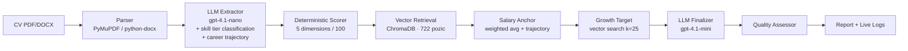

# 🧠 AI Job Fit & Salary Estimator

Case-study demo: nahraj CV (PDF/DOCX) a získej extrahovaný profil, 5-rozměrné skóre seniority, deterministicky vypočítaný odhad měsíční mzdy v ČR a konkrétní cestu k +30 % platu.

Postavené nad daty z [platy.cz](https://platy.cz) (722 pozic).

---

## Quick start

### Docker (doporučené)

```powershell
# 1. zkopíruj .env.example a doplň OPENAI_API_KEY
copy .env.example .env
# (otevři .env a vlož klíč)

# 2. spusť celý stack
docker compose up -d --build

# 3. ověř, že oba containery jsou healthy
docker compose ps

# 4. otevři http://localhost:8501
```

Stop / restart / logs:

```powershell
docker compose logs -f backend     # follow backend logs
docker compose restart backend     # po změně .env
docker compose down                # zastav vše
docker compose down -v             # včetně volumes (pozor: smaže Chroma store)
```

ChromaDB store i pre-built embeddings se persistují přes bind mount `./backend/data` →
přežijí rebuild i `compose down`. První start trvá ~5 s (load 722 pozic z `positions_embeddings.jsonl`).

### Lokální dev (rychlejší iterace, bez dockeru)

```powershell
# Backend
cd backend; uv sync; uv run uvicorn cv_evaluator.main:app --reload --port 8000

# Frontend (v dalším terminálu)
cd frontend; uv sync; $env:API_URL="http://localhost:8000"; uv run streamlit run app.py
```

`.env` má backend pro lokální dev v repo rootu (config.py ho hledá automaticky).

---

## Jak jsem přistoupil k datům

Zadání mi explicitně neposkytuje žádný dataset, takže jsem si ho musel obstarat. Volby:

**A) Použít LLM jako oracle pro mzdy** ❌ Halucinace, neexistuje ground truth, výsledky se mění mezi runy.

**B) Synthetic data od LLM** ❌ Reflektuje LLM predispozici, ne český trh.

**C) Reálný platový dataset** ✅ Použil jsem [platy.cz](https://platy.cz) – veřejně dostupné platové percentily pro 722 pozic v ČR.

### Co je v `backend/data/salaries.jsonl`

Každý záznam obsahuje:

```json
{
  "group": "Informační technologie",
  "position": "Programátor (vývojář)",
  "p10_monthly_czk": 38000,        // 10. percentil
  "p90_monthly_czk": 90000,        // 90. percentil
  "after_5_years_monthly_czk": 65000,
  "category_low_monthly_czk": null, // fallback pokud konkrétní pozice nemá data
  "category_high_monthly_czk": null,
  "duties": ["...", "..."]         // popis povinností (vstup do retrievalu)
}
```

### Co jsem s daty udělal

1. **Normalizace na canonical schéma**: `salary_low / salary_high / salary_after_5y` + `salary_source ∈ {position, category}`. Pokud konkrétní pozice nemá percentily (`has_position_data: false`), použije se rozpětí celé profesní skupiny a označí jako méně přesný zdroj (`category`). Frontend tuto fallback-úroveň zobrazuje uživateli (badge "konkrétní pozice" vs. "celá skupina").

2. **Pre-computed embeddings** (`scripts/build_embeddings.py`): jednorázově se zavolá `text-embedding-3-small` nad textem `"{position} ({group}). {duties}"` a vektory se uloží do `positions_embeddings.jsonl`. Při startu serveru se hydratuje ChromaDB z tohoto souboru – **runtime nikdy nevolá OpenAI pro embedding pozic**, jen pro embedding query CV.

3. **Nemám hardcoded skill taxonomii**: zkusil jsem si ji vyrobit (~250 skillů s tier weighting), ale narazil na škálovatelnost (pizzaři, sommeliéři, kominíci...). Místo toho LLM klasifikuje skill tier (`expert/core/basic`) přímo v rámci extrakce – funguje univerzálně napříč obory bez údržby.

4. **Eval golden dataset** (17 ručně anotovaných CVs): vlastní syntetické CVs pokrývající IT i non-IT obory s ground-truth seniority/salary range. Slouží pro měření kvality pipeline (`make eval`).

### Limitace dat

- ČR-specifické (platy.cz nemá data o EU/UK/US trzích)
- Snapshotted v čase (jaro 2026), nepřepočítává se k inflaci
- Některé pozice mají jen "category" fallback → méně přesné odhady (UI to označuje)
- Žádné regional data (Praha vs. regiony) – v této verzi ignorováno

---

## Architektura



### Klíčové stavební bloky

| Komponenta | Soubor | Co dělá |
|---|---|---|
| **Parser** | `backend/src/cv_evaluator/steps/parser.py` | PDF/DOCX → text |
| **Extractor** | `steps/extractor.py` + `prompts/extractor.py` | LLM call s `with_structured_output(ExtractedCV)`. Extrahuje skills (s **canonical názvem + tier classification expert/core/basic** pro každý), praxi, education, role, **personality traits** (4 kategorie) a **career trajectory**. Funguje univerzálně napříč obory (IT, zdravotnictví, řemesla, …) – žádná hardcoded taxonomie. |
| **Scorer** | `steps/scorer.py` | Rule-based 5D skóre 0-100. Maxima: experience=35, skills=25 (tier-weighted z LLM klasifikace), education=10, role=15, **personality=15**. České + EN role keywords s diakritickou normalizací. |
| **Retrieval** | `services/embeddings.py` | Cosine similarity vůči 722 pozicím v ChromaDB. Query je **position-driven**, ne skill-driven. |
| **Salary Anchor** | `steps/salary_anchor.py` | **Deterministická** kotva: vážený průměr matchů × seniority skóre × trajectory modifier. LLM má povolen drift jen ±10 %. |
| **Growth Target** | `steps/growth_target.py` | Najde konkrétní roli, která dosahuje `anchor.center × 1.30`. Vector search nad ChromaDB (k=25), filtr na cílovou mzdu, pick by similarity. |
| **Finalizer** | `steps/finalizer.py` + `prompts/finalizer.py` | Druhý LLM call: dostane všechno výše + anchor jako constraint, vyrobí salary range, vysvětlení a actionable growth plan. |
| **Quality Assessor** | `steps/quality_assessor.py` | 5 sanity signálů → `high/medium/low` confidence. |
| **Cost Tracker** | `services/cost_tracker.py` | Per-job USD/CZK náklady přes LangChain callbacks. |

---

## Design decisions

### 1. Proč 2 LLM calls a ne 1?

- **Extractor (gpt-4.1-nano, T=0)**: čistá, levná, deterministická úloha (parsování). Strukturovaný output garantuje schéma.
- **Finalizer (gpt-4.1-mini, T=0.2)**: vyžaduje kreativitu na vysvětlení a růstový plán. Mírně vyšší teplota, ale s deterministickou kotvou jako constraint.

Sloučení do jednoho calla by znamenalo nano nebo mini na obojí – buď drahé, nebo nepřesné.

### 2. Proč deterministická salary anchor?

Když LLM dostane jen `matches_json`, hádá. Stejné CV → různé výsledky. Anchor je vážený průměr nad matchi:

```
center = base_low + (base_high - base_low) × (score / 50)        # for score ≤ 50
center = base_high + (base_after5 - base_high) × ((score-50)/50)  # for score > 50
```

LLM dostane `[anchor.min, anchor.max]` jako pevný range a v něm ještě dá konkrétní `min/max` pro UI. **Stejné CV vždy stejný plat.**

### 3. Proč position-driven retrieval, ne skill-driven?

Chroma korpus je `"{position} ({group}). {duties}"`. Když query vystaví ze skills (`"TypeScript, React, …"`), uchazeč-analytik s TypeScriptem v CV se přilepí na vývojářské pozice. Skills se používají uvnitř LLM finalizéru pro doladění uvnitř rozsahu, ne pro retrieval.

### 4. Proč LLM-based tier classification, ne hardcoded taxonomie?

**Iterace 1 (zahozeno)**: hardcoded JSON taxonomie ~250 skillů s ručně přiřazenými tiery. Outcome: nepokrylo to pizzaře, kominíky, sommeliéry. Údržba ručního seznamu = nekonečný backlog. Nešlo dynamicky reagovat na CV uchazeče s neobvyklou kombinací.

**Iterace 2 (aktuální)**: LLM klasifikuje tier **v rámci extrakce**, společně s canonical názvem. Tier definice jsou v promptu:

- `expert`: specializovaná, hůř dostupná, market differentiator (Kubernetes, ECMO, IFRS, autorizace ČKAIT, sommelier, AVPN cert.)
- `core`: standardní profesní skill pro roli (Python, EKG, AutoCAD, podvojné účetnictví, výroba neapolské pizzy)
- `basic`: obecný/přenositelný (Word, Excel, ŘP B)
- `unknown`: jen v krajním případě (LLM má pokyn vyhnout se)

LLM má **plný kontext** – pozici uchazeče, ostatní dovednosti, obor – takže může klasifikovat skill v kontextu. "Excel" pro účetního = core, pro full-stack devela = basic. Funguje pro cokoliv: pizzař, kovář, kameraman, advokát, …

Skóring pak používá tier weights `expert=3.0, core=1.0, basic=0.3, unknown=0.5`. Senior backend s K8s/Kafka má plný score, office worker s Wordem/Excelem ~1.2/25 – výsledek je stejný jako u hardcoded taxonomie, ale **bez údržbového dluhu**.

### 5. Proč osobnostní rysy a kariérní trajektorie?

Zadání case study to explicitně vyžaduje:

> _"vypočte skóre seniority skládající se z dovedností, zkušeností, **osobnostních rysů**, vzdělání"_
>
> _"vyhodnotí jeho zkušenosti, dovednosti, senioritu, **potenciál**"_

Personality_traits jsou 4 kategorie konkrétních signálů (leadership / initiative / collaboration / growth). Nejde o subjektivní hodnocení, ale o **citace z CV**. Career trajectory (`ascending/stable/lateral/descending`) modifikuje salary anchor o ±8 %.

---

## Evaluation framework

Single biggest differentiator této case study – **měřitelnost**.

```bash
cd backend
make eval              # plný eval s LLM-as-judge (12 CVs, ~30s)
make eval-no-judge     # bez judge (rychlejší, levnější)
make eval-quick        # 3 CVs bez judge (smoke test)
```

### Co se měří

| Metrika | Co kontroluje |
|---|---|
| `skills_jaccard_avg` | Set similarity extrahovaných skills vs. ground truth |
| `yoe_mae_avg` | Mean Absolute Error u `years_of_experience` |
| `education_match_pct` | % CVs se správným education levelem |
| `trajectory_match_pct` | % CVs se správným kariérním směrem |
| `seniority_in_range_pct` | % seniority skóre uvnitř očekávaného rozpětí |
| `salary_in_range_pct` | % salary mid uvnitř očekávaného rozpětí |
| `has_growth_plan_pct` | % CVs s vygenerovaným growth planem |
| `data_quality_score_avg` | Průměrná kvalita dat (0-1) |
| `judge_*` (LLM-as-judge) | Specificity / Actionability / Grounding / Consistency (1-5) |

Reporty se ukládají do `backend/src/cv_evaluator/evals/reports/`.

### Dataset

17 ručně anotovaných CVs (`backend/src/cv_evaluator/evals/datasets/golden_cvs.jsonl`) pokrývajících:
- Junior / Mid / Senior / Principal
- IT (backend, frontend, devops, data, ML), Marketing, HR, Sales, Admin
- **Non-IT**: vrchní sestra JIP, stavbyvedoucí, senior účetní, šéfkuchař (fine-dining), řidič kamionu
- Edge cases: career changer (lateral trajectory), high-school role, PhD ML engineer

---

## Live backend logy v UI

Frontend má rozkliknutelnou tmavou konzoli (`🖥 Backend konzole`), která se během zpracování CV plní logy v reálném čase – přesně vidíš, kolik tokenů spotřebovalo každé LLM volání, jaká kotva se spočítala, který growth target se vybral a proč.

Implementace: každý request nastaví `current_job_id` přes `contextvars.ContextVar`. Vlastní `JobLogHandler` registrovaný na `cv_evaluator` loggeru čte tento ContextVar a routuje záznamy do per-job ring bufferu (max 500 entries). Frontend polluje endpoint `GET /api/v1/logs/{job_id}?since=N` s incremental offsetem.

Důsledek: logy z `salary_anchor.py`, `growth_target.py`, atd. nepotřebují vědět o `job_id` – ContextVar se propaguje skrz async tasky automaticky.

---

## Cost tracking

Každý job tracuje USD/CZK náklady na LLM volání. Ceny v `services/cost_tracker.py` (gpt-4.1-nano: $0.0001/$0.0004 per 1k, gpt-4.1-mini: $0.0004/$0.0016 per 1k).

Footer v UI: _"💸 Náklady na tento odhad: 0.42 Kč (3 LLM volání)"_.

---

## Testy a kvalita kódu

```bash
make test                        # 16 unit testů, ~0.1 s
uvx ruff check src/ tests/       # lint (F-codes čisté)
```

16 critical-path testů pokrývá:
- **Scorer** (7 testů): senior dev high score, office worker low, junior mid, **pizzař (test univerzálnosti)**, dimensions sum, CZ senior keywords (8 variant včetně bez-diakritických), max cap
- **Salary anchor** (5 testů): determinismus, low/high score mapování, trajectory modifier, drift symetrie
- **Quality assessor** (4 testy): high/low confidence, category warning, unknown-tier ratio warning

LLM-závislé části nejsou unit-testovány (jsou pokryty eval frameworkem).

**Code hygiene**: žádné nepoužité importy, funkce ani konstanty (ruff F401/F811/F841 prochází). Dependencies trimmed na minimum (žádný meta `langchain`, žádný `python-dotenv` v backendu – řeší pydantic-settings).

---

## Project structure

```
backend/
├── src/cv_evaluator/
│   ├── api/routes.py             # FastAPI endpoints + pipeline orchestrace
│   ├── steps/                    # jednotlivé pipeline kroky
│   │   ├── parser.py
│   │   ├── extractor.py          # LLM call #1 (gpt-4.1-nano) – extrakce + tier classification
│   │   ├── scorer.py             # 5D rule-based scoring
│   │   ├── salary_anchor.py      # deterministická kotva
│   │   ├── growth_target.py      # +30 % cílová role
│   │   ├── finalizer.py          # LLM call #2 (gpt-4.1-mini)
│   │   └── quality_assessor.py
│   ├── services/
│   │   ├── embeddings.py         # ChromaDB + query cache
│   │   └── cost_tracker.py
│   ├── log_store.py              # per-job log capture (ContextVar) pro frontend streaming
│   ├── prompts/                  # LLM prompty (CZ) – tier definice v extractor.py
│   ├── evals/                    # eval framework
│   │   ├── datasets/golden_cvs.jsonl
│   │   ├── metrics.py
│   │   ├── llm_judge.py
│   │   └── runner.py
│   ├── models.py                 # Pydantic schémata
│   └── config.py                 # pydantic-settings (env > .env > defaults)
├── data/
│   ├── salaries.jsonl            # 722 pozic z platy.cz
│   ├── positions_embeddings.jsonl  # pre-computed embeddings (regen via build_embeddings.py)
│   └── chroma/                   # persistent Chroma store
├── tests/
└── scripts/build_embeddings.py
frontend/app.py                   # Streamlit UI
docker-compose.yml
```

---

## How I'd evolve this for B2B

Toto je B2C demo. Pro B2B nasazení (matching tomu, co AI Architect role řeší) by přibylo:

1. **Tenant isolation**: namespace-per-client v Chromě, zašifrovaná data at rest. Každý klient může mít vlastní `seniority_weights`, `skill_taxonomy`, `salary_dataset` přes `TenantConfig` model.
2. **Custom dataset upload**: klienti nahrávají vlastní platové data přes API (nahrazují/rozšiřují platy.cz korpus).
3. **Webhook callbacks**: místo pollingu push výsledků do klientových systémů (HR ATS).
4. **Bulk evaluation**: batch endpoint pro HR systémy zpracovávající stovky CVs naráz.
5. **Audit log**: každá změna skóre dohledatelná pro compliance (GDPR Art. 22 – automated decisions).
6. **A/B prompt versioning**: tenant-specific prompt varianty + eval per-tenant.
7. **Persistent job store**: aktuálně in-memory; pro produkci Redis/Postgres aby joby přežily restart.

---

## Limitations & what's not done

⚠️ **Není testováno**:
- Edge cases v PDF parseru (multi-column CVs, scanované obrázkové PDF).
- Concurrent job handling pod load.
- LLM extraction quality (pokryto eval frameworkem, ne unit testy).

🚧 **Vyžadovalo by víc času**:
- **Hybrid retrieval** (BM25 + dense). Aktuálně jen dense; u krátkých position queries by BM25 pomohl pro přesné názvy.
- **Bias audit** (gender / age / ethnicity v jménech). Komplexní téma, vyžaduje samostatný framework.
- **Multi-language**: aktuálně CZ + EN. Polština / slovenština by chtěla normalizaci diakritiky.
- **Embedding fine-tuning** na CV doménu. Bez labeled data spekulativní – přínos vs. cena nejasný.
- **Streaming UX** přes SSE místo pollingu. Polling teď funguje, swap by byl jen za zlepšení perceived latency.

---

## Tech stack

- **Backend**: FastAPI, `langchain-core` + `langchain-openai` + `langchain-chroma` (ne meta `langchain`), OpenAI (gpt-4.1-nano + gpt-4.1-mini + text-embedding-3-small), ChromaDB, pydantic-settings, numpy, tenacity. Python 3.12, `uv`.
- **Frontend**: Streamlit + Plotly + httpx.
- **Orchestrace**: docker-compose, healthchecky bez `curl` (urllib přes Python), non-root user v containerech.
- **Eval**: vlastní framework – 17 golden CVs + numeric metrics + LLM-as-judge.

---

## License

Demo project. Salary data © [platy.cz](https://platy.cz).
